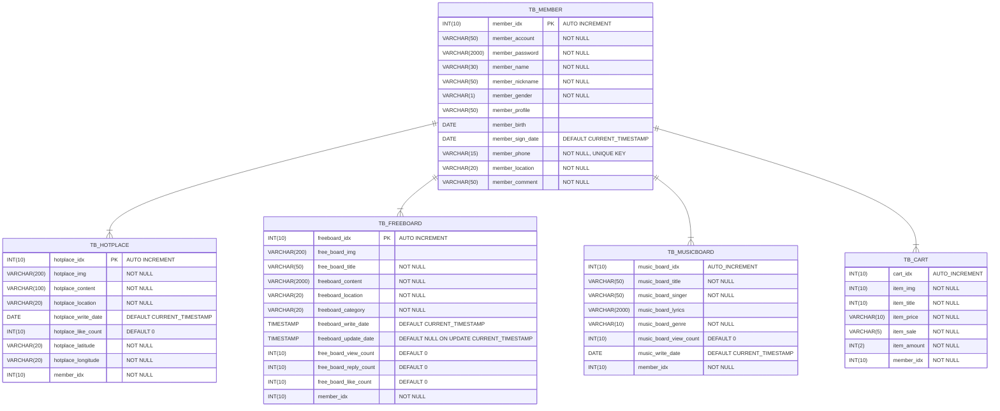

```mermaid
erDiagram 
    TB_MEMBER||--|{TB_HOTPLACE :""
    TB_MEMBER{
        INT(10) member_idx PK "AUTO INCREMENT"
        VARCHAR(50) member_account "NOT NULL"
        VARCHAR(2000) member_password "NOT NULL"
        VARCHAR(30) member_name "NOT NULL"
        VARCHAR(50) member_nickname "NOT NULL"
        VARCHAR(1) member_gender "NOT NULL"
        VARCHAR(50) member_profile
        DATE member_birth 
        DATE member_sign_date "DEFAULT CURRENT_TIMESTAMP"
        VARCHAR(15) member_phone "NOT NULL, UNIQUE KEY"
        VARCHAR(20) member_location "NOT NULL"
        VARCHAR(50) member_comment "NOT NULL"
    }
    
    TB_HOTPLACE{
        INT(10) hotplace_idx PK "AUTO INCREMENT"
        VARCHAR(200) hotplace_img "NOT NULL"
        VARCHAR(100) hotplace_content "NOT NULL"
        VARCHAR(20) hotplace_location "NOT NULL"
        DATE hotplace_write_date "DEFAULT CURRENT_TIMESTAMP"
        INT(10) hotplace_like_count "DEFAULT 0"
        VARCHAR(20) hotplace_latitude "NOT NULL"
        VARCHAR(20)  hotplace_longitude "NOT NULL"
        INT(10) member_idx "NOT NULL"
    }
    TB_MEMBER||--|{TB_FREEBOARD :""
    
    TB_FREEBOARD{
        INT(10) freeboard_idx PK "AUTO INCREMENT"
        VARCHAR(200) free_board_img
        VARCHAR(50) free_board_title "NOT NULL"
        VARCHAR(2000) freeboard_content "NOT NULL"
        VARCHAR(20) freeboard_location "NOT NULL"
        VARCHAR(20) freeboard_category "NOT NULL"
        TIMESTAMP freeboard_write_date "DEFAULT CURRENT_TIMESTAMP"
        TIMESTAMP freeboard_update_date "DEFAULT NULL ON UPDATE CURRENT_TIMESTAMP"
        INT(10) free_board_view_count "DEFAULT 0"
        INT(10) free_board_reply_count "DEFAULT 0"
        INT(10) free_board_like_count "DEFAULT 0"
        INT(10) member_idx "NOT NULL"
    }
    TB_MEMBER||--|{TB_MUSICBOARD :""
    
    TB_MUSICBOARD{
    INT(10) music_board_idx "AUTO_INCREMENT"
    VARCHAR(50) music_board_title "NOT NULL"
    VARCHAR(50) music_board_singer  "NOT NULL"
    VARCHAR(2000) music_board_lyrics 
    VARCHAR(10) music_board_genre  "NOT NULL"
    INT(10) music_board_view_count "DEFAULT 0"
    DATE music_write_date "DEFAULT CURRENT_TIMESTAMP"
    INT(10) member_idx "NOT NULL"
    }
    TB_MEMBER||--|{TB_CART :""
    
    TB_CART{
    INT(10) cart_idx "AUTO_INCREMENT"
    INT(10) item_img "NOT NULL"
    INT(10) item_title   "NOT NULL"
    VARCHAR(10) item_price  "NOT NULL"
    VARCHAR(5) item_sale  "NOT NULL"
    INT(2) item_amount  "NOT NULL"
    INT(10) member_idx "NOT NULL"
    }
    
    
```