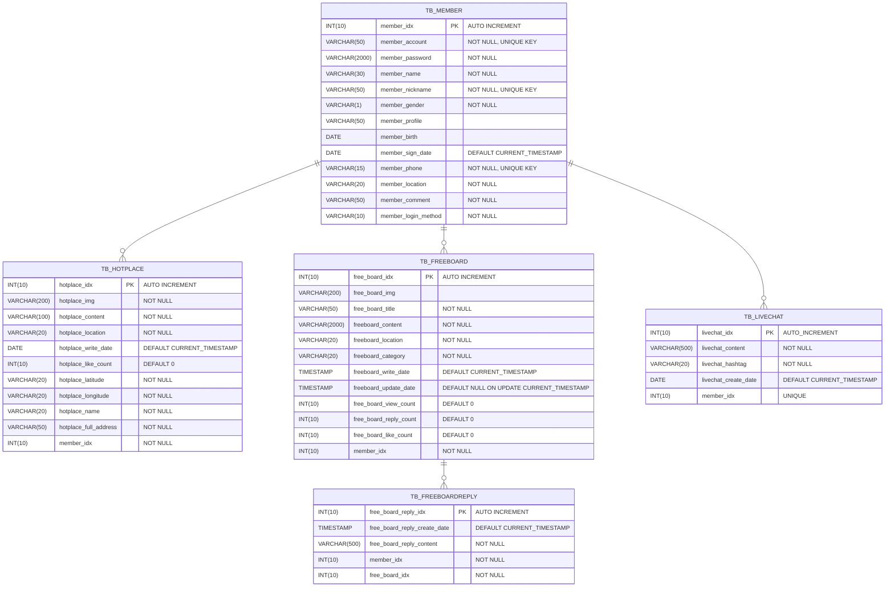
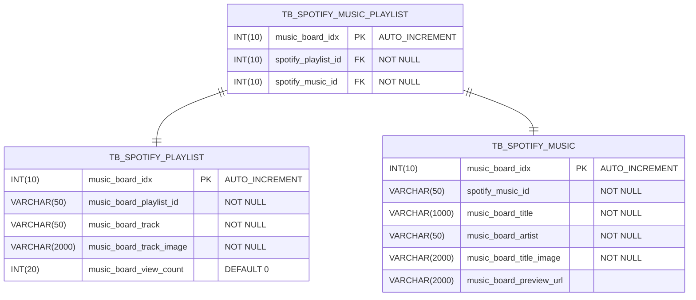
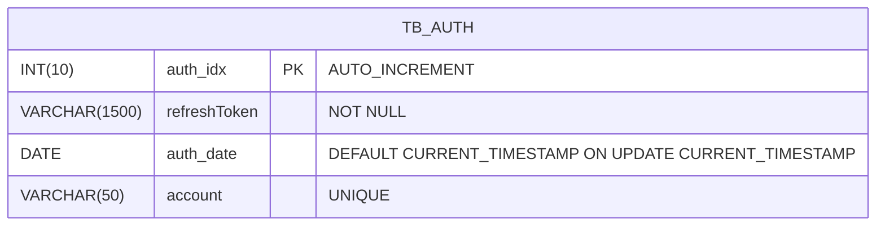

````mermaid
erDiagram
    TB_CVS{
        INT(10) cvs_idx PK "AUTO_INCREMENT"
        VARCHAR(200) cvs_img "NOT NULL"
        VARCHAR(50) cvs_title "NOT NULL"
        VARCHAR(10) cvs_price "NOT NULL"
        VARCHAR(5) cvs_sale "NOT NULL"
        VARCHAR(10) cvs_type "NOT NULL"
        DATE cvs_reg_date "DEFAULT CURRENT_TIMESTAMP"
    }
````
