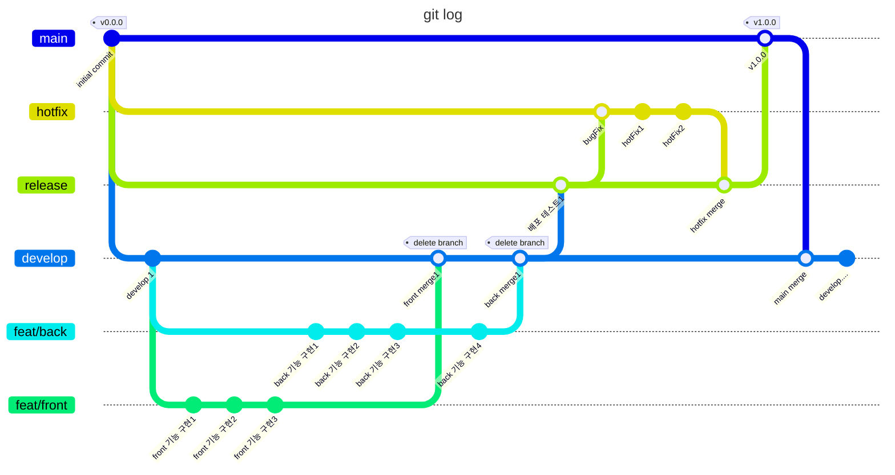

# ✈️ [Connect-Dots.site](http://connect-dots.site/)

 
 
 

### 🌈 개요

---

지역의 가치를 창조하는 동네 친구 서비스!  
다양한 정보를 얻을 수 있으며 동네 친구들과 소통을 해보세요.  
(⚠️현재는 서울시 25개구를 기준으로 제공됩니다.)

 
 

### 🚀 개발 목표

---

데드라인이 중요하기 때문에 마일스톤을 잘 설정하고 어떠한 전략들이 우리에게 효율적인지 찾고 해당 프로젝트에 적용했습니다. 
사용자의 니즈를 충족 시켜줄만한 서비스인 플레이 리스트와 편의점 행사 정보 기능, 
주변 사람들과 소통할 수 있는 창구 등 다양한 아이디어가 나왔지만 우리의 방향성과 맞는 기능을 중심적으로 채택하였습니다. 
제공될 서비스의 우선 순위가 무엇인지, 사용자 관점에서 어떤 기능들이 필요한지 파악했고 프로젝트를 진행하였습니다. 

 
 

### 🎲 Service

---

#### 🔥 Hot Place

> 👩‍💻 담당자 : 박수민  
> 🎯 구현 로직 주소 들어갈 예정

동네에 있는 맛집이나 나만 아는 장소가 있나요? 🤔 
그렇다면 사진과 위치를 공유해주세요! 
간단한 내용도 작성해주시면 좋아요! 

 

#### 📱 자유게시판

> 👨‍💻 담당자 : 이기덕  
> 🎯 구현 로직 주소 들어갈 예정

아무 말, 아무 사진이나 올리고 싶다고요? 🤔 
동네 친구들에게 다양한 글을 써보세요! 

 

#### 💬 실시간 채팅

> 👨‍💻 담당자 : 이기덕  
> 🎯 구현 로직 주소 들어갈 예정

게시판 소통이 답답하다면, 실시간으로 채팅을 해보세요! 😁 
지역에 상관없이 누구나 자유롭게 이용이 가능합니다 

 

#### 🎧 플레이 리스트

> 👩‍💻 담당자 : 권상지  
> 🎯 구현 로직 주소 들어갈 예정

지금 유행하는 노래가 궁금하신가요? 🤔 
너가 뭘 좋아할지 몰라서 다 준비했어..! 
약 900곡의 추천 리스트를 받아보세요 

 

#### 🏪 편의점 정보

> 👨‍💻 담당자 : 이재필  
> 🎯 구현 로직 주소 들어갈 예정

분명 어제까지 1+1이었는데... 😕 
헷갈리는 편의점 행사 정보들.. 
이제 행사 정보들을 한 눈에 볼 수 있어요! 😆 

 
 
 
 

## 🗣️ Develop Story

 
 

### 🫥 Members

---

| 개발자       | 담당                     | gitHub                                    | 한 마디         | MBTI |
|-----------|------------------------|-------------------------------------------|--------------|------|
| 🧑‍💻 이기덕 | 👉 `PM` Back           | [🐈‍⬛ gitHub](https://github.com/lkdcode) | 되면 한다!       | INTP |
| 👩‍💻 권상지 | 👉 `PL-B` Back & Front | [🐈‍⬛ gitHub](https://github.com/qwr133)  | 맥북 에어 15 산다! | ISFP |
| 🧑‍💻 원석빈 | 👉 `PL-F` Front        | [🐈‍⬛ gitHub](https://github.com/ejdrp1)  | 끝까지 간다!      | ISFJ |
| 👩‍💻 박수민 | 👉 Back & Front        | [🐈‍⬛ gitHub](https://github.com/330sum)  | 회식하려고 프젝한다!  | ENFP |
| 👩‍💻 이재필 | 👉 Back & Front        | [🐈‍⬛ gitHub](https://github.com/JeFeel)  | 일단 해본다!      | ISFJ |

 
 

### 📚 Skill Stack

---

 

#### 📜 FRONT

 

 

 

#### 🛠️ BACK

 

 

#### 📀 DB

 

#### ✂️ Tool

 

#### 🌐 배포

 
 

### 📆 개발 일정 요약본

---

 
 

```mermaid
gantt
    title 2023.05.30 - 2023.07.03
    dateFormat X
    axisFormat %s
    section WireFrame
        기획: -2, 3
    section 기능 구현
        Develop: 2, 24
    section 테스트
        Test & BugFix: 20, 29
    section 배포
        AWS: 27, 33
```

### 🧲 Git Flow

---

 
 
