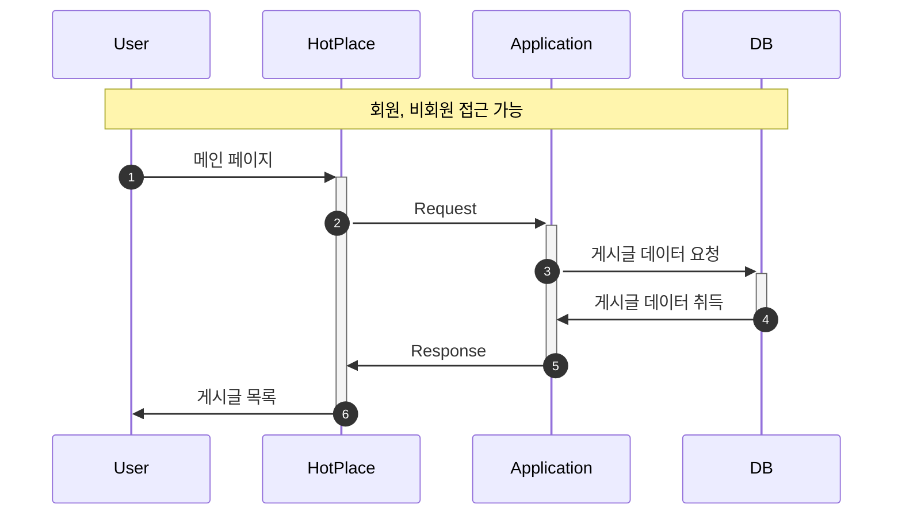
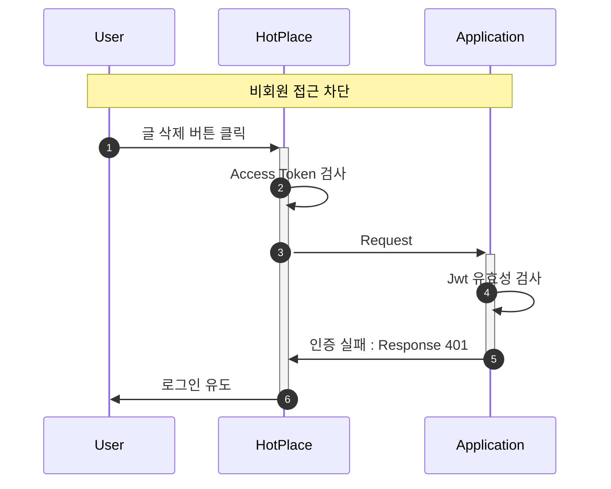
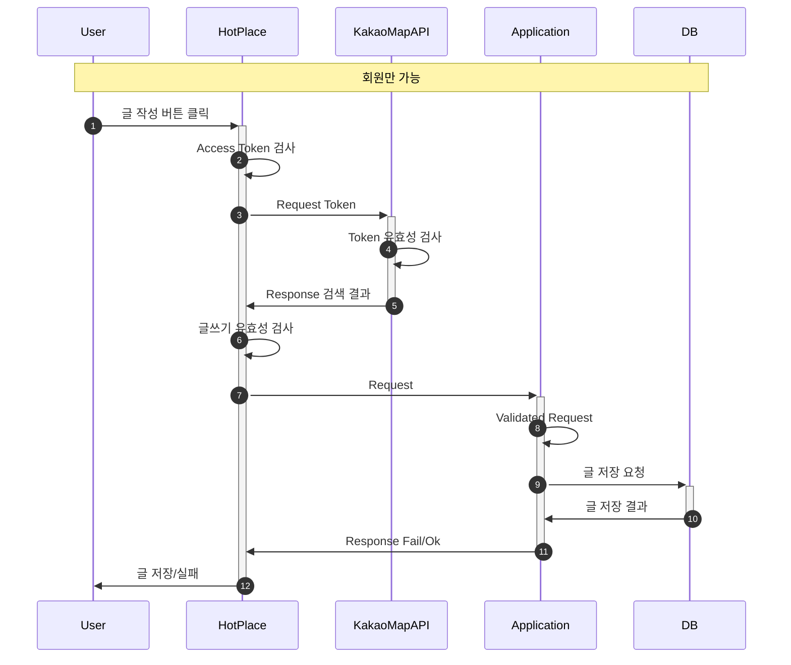
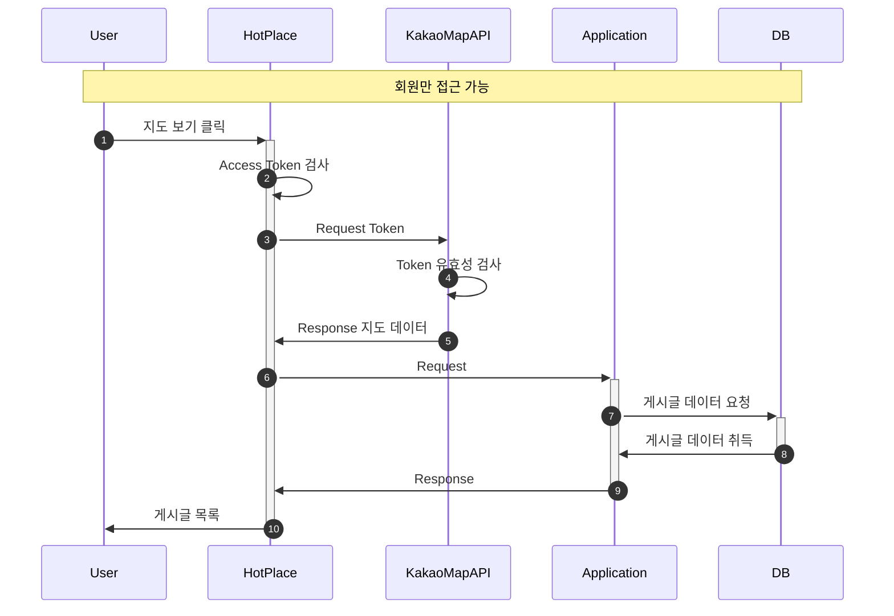
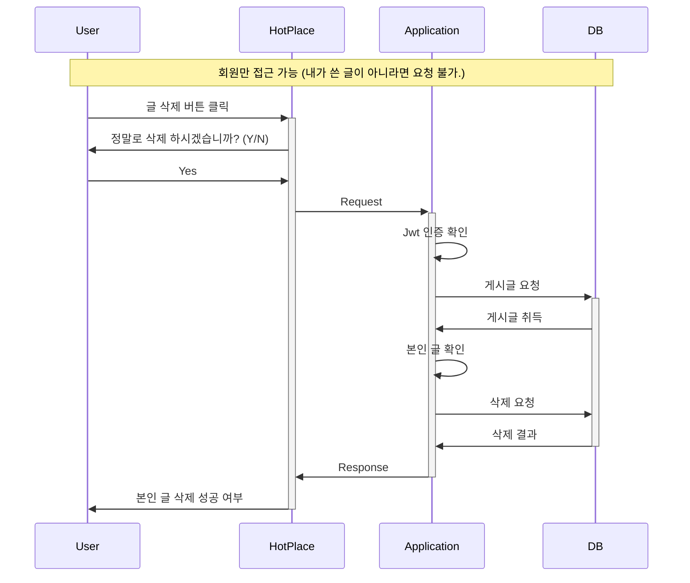

## 🔥 Hot Place

---

> 👩‍💻 담당자 : 박수민 
> 👉 [GitHub](https://github.com/330sum)

 
 

### 🚀 Goal

---

> 자유로운 글과 사진을 올릴 수 있는 게시판을 구현한다. 
> - #### 비회원/회원 공통
> - 작성된 글 전체 보기를 할 수 있다.
> - 작성된 글 검색 조회를 할 수 있다.
> - #### 회원
> - 글쓰기가 가능하다
> - 사진, 내용, 장소를 등록할 수 있다.
> - 글 수정, 삭제가 가능하다.
> - 지도 검색이 가능하다.
> - #### 비회원
> - 글쓰기가 불가하다.
> - 지도 검색이 불가하다.

 
 

### 🎯 기능 구현 로직

---

#### 접근 권한

| 기능       | 비회원 | 회원  |
|----------|-----|-----|
| 전체 글 보기  | ⭕️  | ⭕️  |
| 검색 조회    | ⭕️  | ⭕️  |
| 지도 조회    | ❌   | ⭕️  |
| 글 쓰기     | ❌   | ⭕️  |
| 글 수정, 삭제 | ❌   | ⭕️  |

 
 

#### 🎈 시퀀스 다이어그램

---

 

#### 🎯 전체 조회

 

#### 🎯 비회원 접근 차단

 

#### 🎯 글쓰기

 

#### 🎯 지도 보기

 

#### 🎯 글 삭제/수정하기

