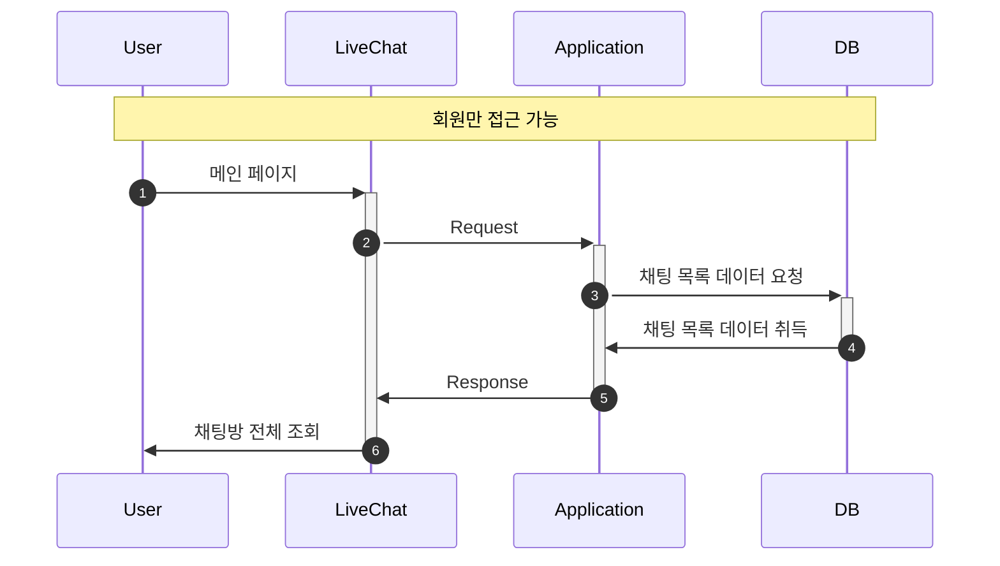
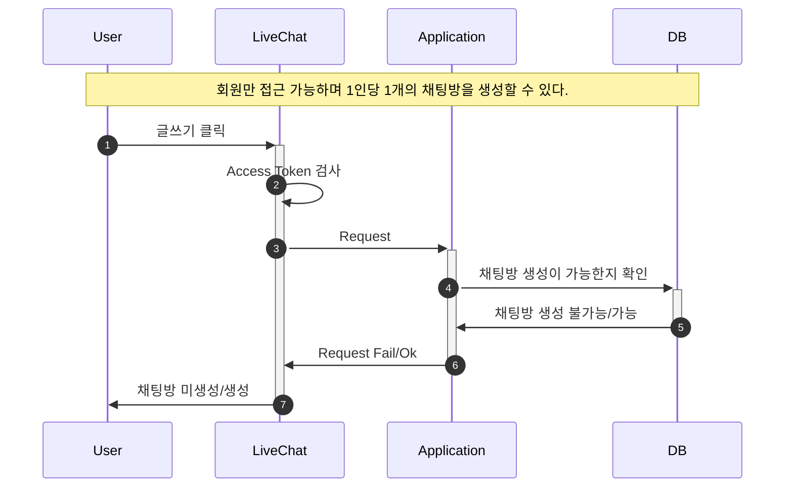
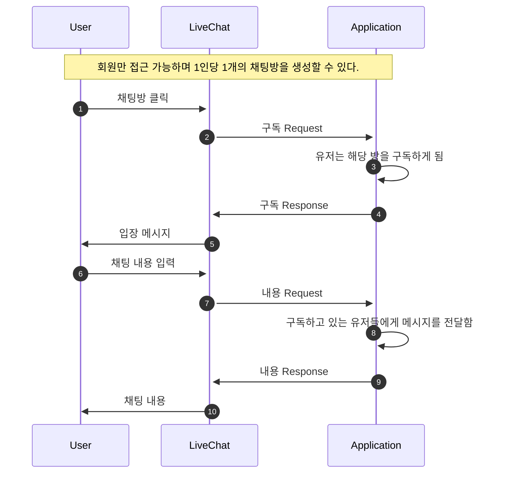

## 📱 LiveChat

---

 
 
 

### 🚀 Goal

---

> 자유로운 글과 사진을 올릴 수 있는 게시판을 구현한다. 
> 전체 게시글의 내용을 간략하게 보여줄 수 있는 페이지가 있다 
> 상세보기 페이지에서 댓글을 작성할 수 있으며 
> 글의 모든 내용과 해당 글의 모든 댓글을 볼 수 있다. 

 
 

### 🎯 기능 구현 로직

---

#### 권한

 

| 기능       | 비회원 | 회원  |
|----------|-----|-----|
| 채팅 목록 보기 | ❌️  | ⭕️  |
| 채팅방 만들기  | ❌   | ⭕️  |
| 채팅하기     | ❌   | ⭕️  |

 
 

#### 🎈 시퀀스 다이어그램

---

 

#### 🎯 전체 조회

 
 

#### 🎯 채팅방 만들기

 
 

#### 🎯 채팅하기 TODO: 해야함

