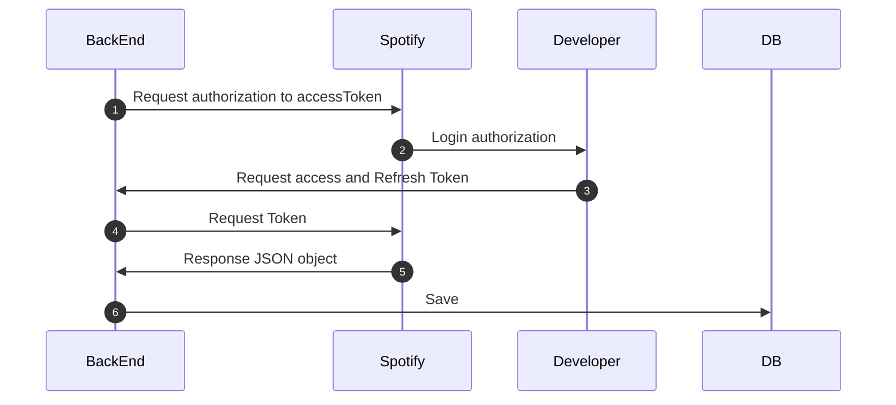
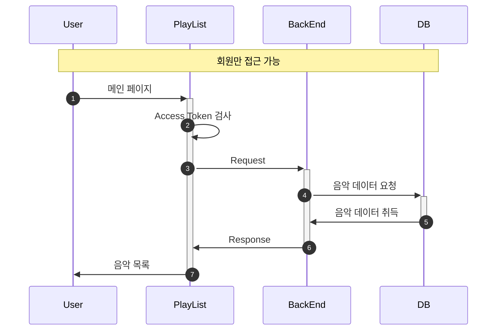

## 🎧 플레이 리스트

---

 
 
 

### 🚀 Goal

---

> Spotify 에서 추천하는 음악 플레이 리스트들을 가져와 유저들에게 제공해준다. 
> 비회원은 접근이 불가하다. 
> 해당 트랙의 주제와 트랙안에 추천 음악 리스트들이 있다. 
> 앨범 커버와 제목, 가수를 보여준다. 
> 미리듣기가 가능한 경우 제공해준다. 

 
 

### 🎯 기능 구현 로직

---

#### 권한

 

| 기능             | 비회원 | 회원  |
|----------------|-----|-----|
| 플레이 리스트 메인 페이지 | ❌   | ⭕️  |
| 추천 리스트 보기      | ❌   | ⭕️  |
| 미리 듣기          | ❌   | ⭕️  |

 
 

#### 🎈 시퀀스 다이어그램

---

 

#### 🎯 SpotifyAPI

 
 

#### 🎯 서비스 이용

